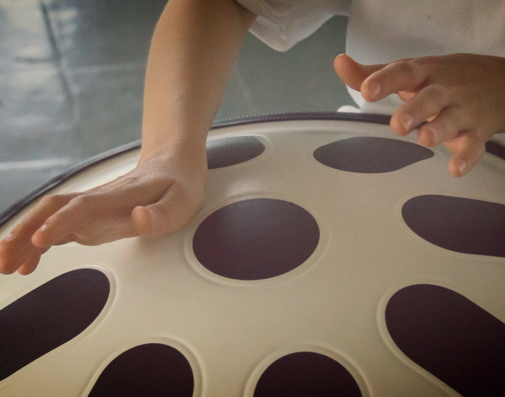

# Hangdrum

Firmware for a MIDI hang-drum using capacitive touch pads.

Blogposts

* [Host-based simulation for embedded systems](http://www.jonnor.com/2017/03/host-based-simulation-for-embedded-systems/)
* [Optimizing latency of an Arduino MIDI controller](http://www.jonnor.com/2017/04/optimizing-arduino-midi-controller-latency/)

## Status
**In production**

* Used as the firmware for [dhang](https://www.dhang.eu/) since March 2017
* Tested on Arduino Lenonardo (Atmega 32u4)
* Latency until triggered sound heard below 20ms with 8 pads, using Windows with ASIO4LL 96samples
* Detection latency around 1ms per pads

## Architecture

The [core](./hangdrum.hpp) of the firmware is platform and I/O independent, written in C++11.
It can run on a Arduino-compatible microcontroller (tested on Arduino Leonardo), or on a host computer (tested on Arch Linux).

A single `State` datastructure holds all state. The program logic is expressed as a pure function of new Input and current State:
`State next = calculateState(const Input inputs, const State current)`.
Both Input and State are plain-old-data which can be safely serialized and de-serialized.
The Hardware Abstraction Layer, which has real-life side-effects, consists of:
A function to read current Input, and a function to "realize" a State.

This formulation allows us to:

* *trace* the execution of the program, by capturing and storing the `Input, State` pairs.
* *replay* a trace, by taking the `Input` and applying it to a modified program
* *visualize* a whole-program execution from its trace, both end-results and intermediates
* *test* a whole-program execution, by applying checks against the generated trace
* *simulate* new scenarios by synthesizing or mutating Input

Wanderers of non-traditional programming methods may recognize inspirations from (Extended) Finite State Machines,
Functional Reactive Programming and Dataflow/Flow-based-programming.
And basically a rejection of Object Oriented Programming (as typically practiced in C++/Java/Python/..),
particularly the idea of combining data and methods that operate on the data into a single class.

## Tools
There is an decent set of analysis, simulation and testing tools available.

* [tools/logserial.py](./tools/logserial.py): Record capacitive sensor input from device.
* [tools/plot.py](./tools/plot.py): Plot a stream of sensor data
* [bin/simulator](./tools/simulator.cpp): Run the firmware on host. Takes a sensor stream as input.
Can run in real-time, producing ALSA MIDI output. Or in faster-than-realtime, producing a Flowtrace of the entire run.
* [tools/plotflowtrace.py](./tools/plotflowtrace.py): Plot a flowtrace produced by simulator, showing decisions made
* [tools/sendserial.py](./tools/sendserial.py`): Send an input sensor stream to device

